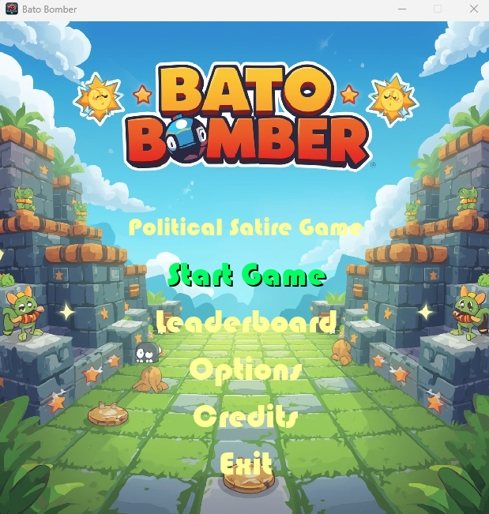
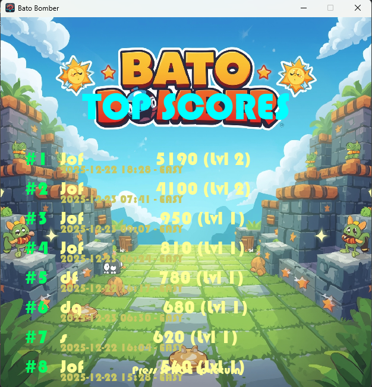
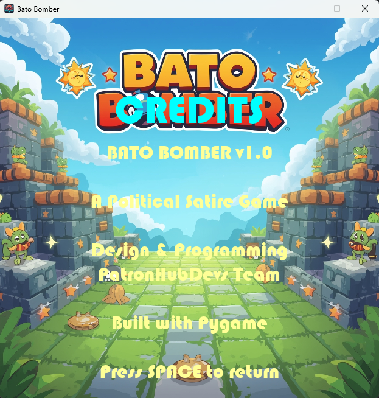
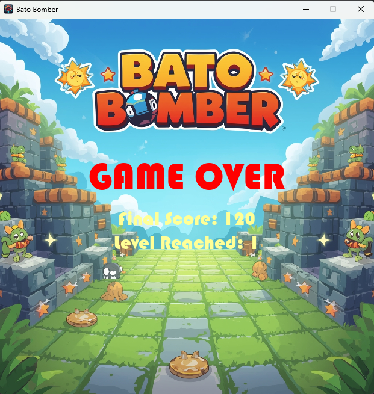

#  Bato Bomber

[](https://www.python.org/downloads/)
[](https://pypi.org/project/Pygame/)
[](LICENSE)
[]()

**Bato Bomber** is a classic arcade-style game inspired by Bomberman, developed using Pygame. It features a political satire theme where players navigate a maze, place bombs, and defeat enemies to advance through levels.

---

## ✨ Key Features

### 💣 **Classic Gameplay**
- **Arcade-Style Action** - Fast-paced, level-based gameplay
- **Destructible Environments** - Bomb your way through walls to clear paths
- **Power-Ups** - Collect items to increase bomb count, blast radius, and speed
- **Multiple Enemy Types** - Face off against different AI-controlled enemies

### ⚙️ **Modern Features**
- **Adjustable Difficulty** - Four settings: Easy, Normal, Hard, and Nightmare
- **Screen Shake Effect** - Adds impact to explosions (can be disabled)
- **Encrypted Leaderboard** - High scores are saved securely to prevent tampering
- **Sound Effects & Music** - Immersive audio for all major game events
- **Pause Functionality** - Pause the game at any time

### 🎨 **User Experience**
- **Customizable Settings** - Adjust music/SFX volume and other options
- **Main Menu** - Clean, intuitive interface for all game modes
- **Bauhaus 93 Font** - Stylish, retro font for a unique look
- **Keyboard Controls** - Simple and responsive controls for all actions

---

## 🚀 Quick Start

### Prerequisites

- **Python 3.8+**
- **pip** (Python package manager)
- **Windows/macOS/Linux**

### Installation

1. **Clone the Repository**
```bash
git clone https://github.com/j3fcruz/Bato_Bomber.git
cd Bato_Bomber
```

2. **Create Virtual Environment** (Recommended)
```bash
python -m venv venv
source venv/bin/activate  # On Windows: venv\Scripts\activate
```

3. **Install Dependencies**
```bash
pip install -r requirements.txt
```

4. **Run Bato Bomber**
```bash
python main.py
```

## 🖼 Screenshots

**Main Window:**



**Top Score Screen:**



**Options Screen:**


**Credits Screen:**



**Gameplay Screen:**


**Game Over Screen:**



**Score Entry Screen:**


---

## 📖 How to Play

### 🎯 Objective
The goal is to defeat all enemies on the map to reveal the exit. Enter the exit to advance to the next level.

### ⌨️ Controls
| Key | Action |
|----------|--------|
| **Arrow Keys** | Move the player (Up, Down, Left, Right) |
| **Spacebar** | Place a bomb |
| **P** | Pause/Resume the game |
| **Escape** | Return to the main menu |

### 💥 Gameplay
- Place bombs to destroy destructible walls and defeat enemies.
- Be careful not to get caught in your own bomb blasts!
- Collect power-ups hidden inside walls to gain advantages.

### ⚡ Power-Ups
- **Bomb Count (B)**: Increases the number of bombs you can place at once.
- **Blast Radius (R)**: Increases the range of your bomb explosions.
- **Speed (S)**: Increases your movement speed.

---

## 📁 Project Structure

```
bato_bomber/
├── main.py                          # Application entry point
├── requirements.txt                 # Python dependencies
├── README.md
│
├── core/                            # Core game logic
│   ├── __init__.py
│   ├── animation.py                # Animation and sprite management
│   ├── game_logic.py               # GameState and core mechanics
│   ├── paths.py                    # Project paths
│   ├── renderer.py                 # Renders all game elements
│   └── sound.py                    # Sound and music management
│
├── config/                          # Configuration files
│   ├── __init__.py
│   └── settings.py                 # Game settings and constants
│
├── gameplay/                        # Game entities
│   ├── __init__.py
│   ├── leaderboard.py
│   └── entities.py                 # Player, Enemy, Bomb, etc.
│
├── data/                            # Game data/
│   ├── __init__.py
│   ├── leaderboard.json
│   ├── secret.key
│   └── settings.json
│
├── resources/                            # Resources/
│   ├── __init__.py
│   ├── resources.qrc
│   └── resources_rc.py

   
```

---

## 🎯 To-Do

- [ ] Add more enemy types with unique behaviors
- [ ] Implement more power-ups (e.g., remote detonation, wall-passing)
- [ ] Add a boss fight at the end of all levels
- [ ] Create a level editor to design custom maps
- [ ] Add controller support

---

## 🙏 Acknowledgments

**Bato Bomber** was built with appreciation for:
- **Pygame** - The core framework for the game
- **PyQt5** - Used for the advanced sound manager
- **cryptography** - For securing the leaderboard and settings
- The open-source community for providing tools and inspiration

---

## 👤 Author

**Marco Polo (PatronHub)**
- 🐙 **GitHub:** [@j3fcruz](https://github.com/j3fcruz)
- ☕ **Ko-fi:** [@marcopolo55681](https://ko-fi.com/marcopolo55681)
- 🌐 **Website:** [PatronHub Devs](https://patronhubdevs.online)

---

**Bato Bomber - Secure Your Fun, Simplify Your Explosions** 💣
